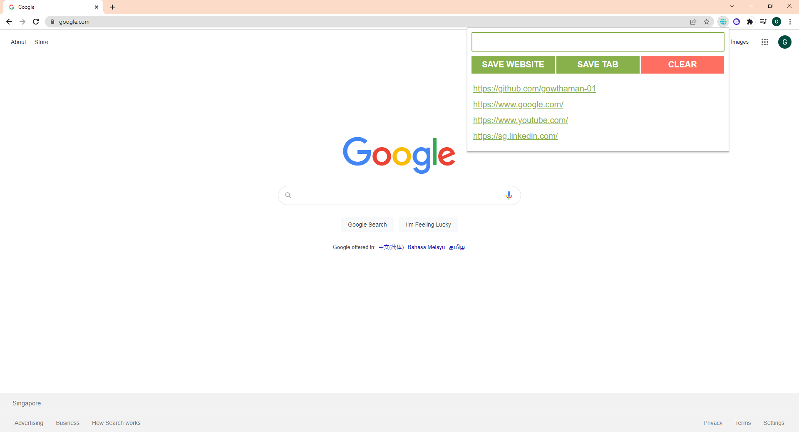

# Reater

A chrome extension that helps you keep track of websites that you have read halfway in order to prevent tab clutter. This extension is helpful for students who are doing research and want a tool to save websites that they want to earn at another time.

## Icon Credits

Web site icons created by Ilham Fitrotul Hayat - Flaticon

https://www.flaticon.com/free-icons/web-site

## Javascript functions

buttonClass.addEventListener("click", function_name)

.innerHTML

document.getElementById("id")

document.createElement("li")
